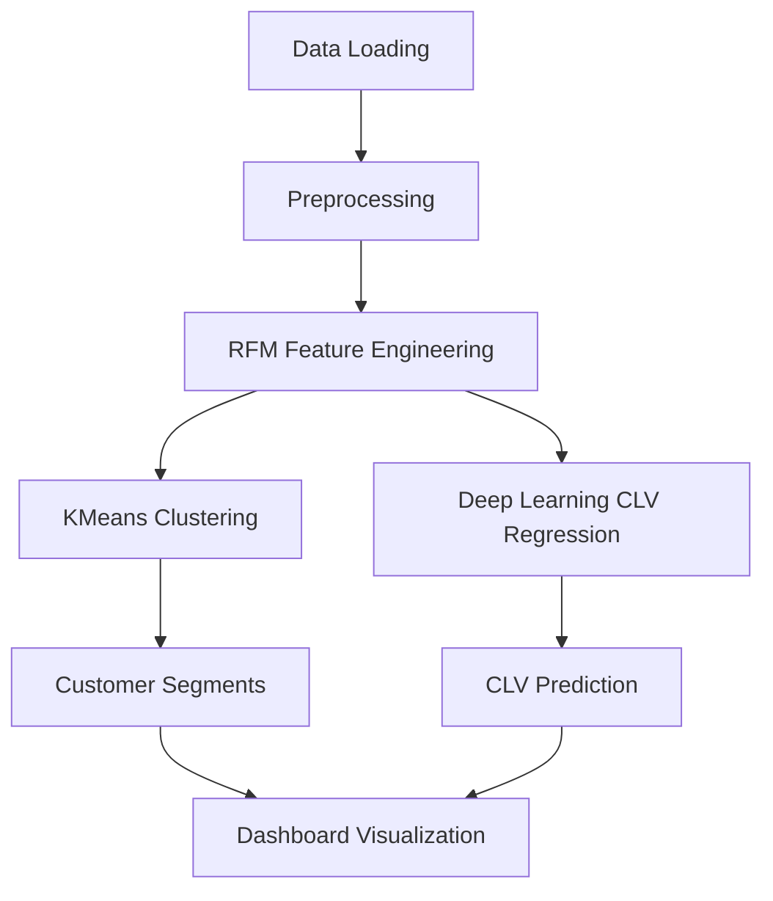
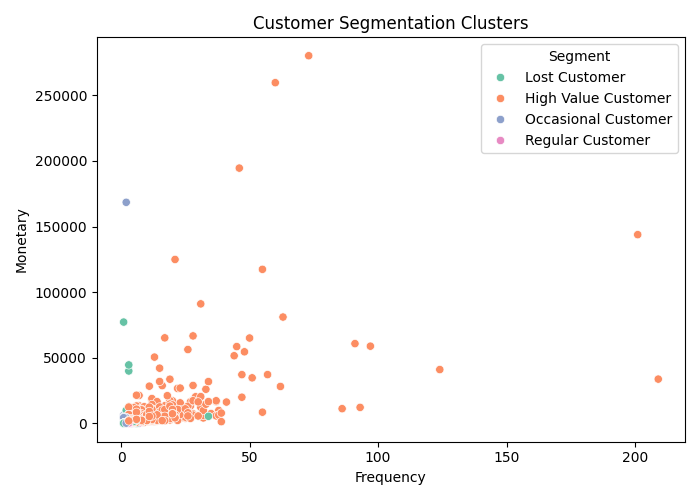
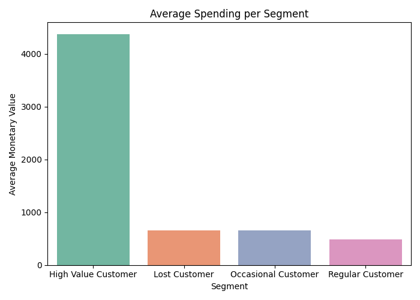
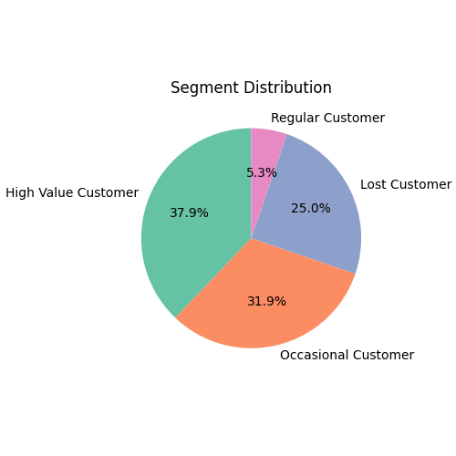

# Customer Segmentation System

## 1. Problem Statement
Businesses need to understand and segment their customers to maximize value and personalize marketing. This project segments customers using RFM analysis and predicts Customer Lifetime Value (CLV) using both classical ML and Deep Learning (DL) models. The system provides actionable insights and interactive dashboards.

## 2. Pipeline Diagram



## 3. Dataset Details

- **Source:** UCI Machine Learning Repository - Online Retail Dataset
- **File:** `dataset/Online Retail.xlsx`
- **Description:** Transactional data from a UK-based online retailer (2010-2011), including InvoiceNo, StockCode, Description, Quantity, InvoiceDate, UnitPrice, CustomerID, Country.

## 4. Model Details (ML + DL)

- **Clustering:** KMeans (for customer segmentation)
- **Regression (CLV Prediction):**
        - **Deep Learning:** Feed-Forward Dense Neural Network (Keras/TensorFlow) for non-linear CLV regression
    - **Baselines:** Linear Regression, Ridge, Lasso, Decision Tree, Random Forest, KNN

## 5. Deep Learning Integration Summary

- **Chosen DL algorithm:** Multi-layer perceptron (Dense Neural Network)
- **Input features:** RFM features (`Recency`, `Frequency`, `Monetary`)
- **Target:** `log1p(Monetary)` for stable training; converted back with `expm1` at inference
- **Integration with ML pipeline:**
    - KMeans + rule-based segmentation remains unchanged
    - ML CLV model (`clv_model.pkl`) and DL CLV model (`deep_clv_model.keras`) are both trained and saved
    - Flask app supports runtime selection (`auto`, `deep`, `ml`) in the same prediction flow
    - Shared model artifacts are stored in `models/` for end-to-end inference

## 6. Required Dependencies / Libraries

From `requirements.txt`:
- pandas
- numpy
- scikit-learn
- matplotlib
- seaborn
- tensorflow
- joblib
- flask
- plotly
- qrcode
- openpyxl

## 7. Steps to Run the Project

Run all commands from the workspace root.

### Step 1: Create virtual environment
```powershell
python -m venv .venv
```
### Step 2: Activate virtual environment
```powershell
.\.venv\Scripts\Activate.ps1
```

### Step 3: Install dependencies
```powershell
pip install -r requirements.txt
```

### Step 4: Train integrated ML + DL pipeline
```powershell
python src/train_hybrid_pipeline.py
```

### Step 5: Evaluate metrics (optional)
```powershell
python metrics.py
```

### Step 6: Start the dashboard
```powershell
python app.py
```
Open: `http://127.0.0.1:5000`

## 8. Demonstration Checklist

- Run `python src/train_hybrid_pipeline.py` and verify these artifacts are created in `models/`:
    - `kmeans_model.pkl`, `scaler.pkl`, `segment_map.pkl`, `rfm_thresholds.pkl`
    - `clv_model.pkl` (ML CLV model)
    - `deep_clv_model.keras`, `deep_clv_scaler.pkl` (DL CLV model)
- Run `python app.py` and open the home page.
- Use the CLV model selector (`Auto`, `Deep Learning`, `Machine Learning`) and submit a prediction.
- Confirm segment, strategy, and CLV value are shown with `Model Used` in the result panel.

## 9. Sample Output / Screenshots

- Console output: Regression metrics (MAE, RMSE, R2) for Deep Learning and baseline models.
- Dashboard: Customer segments, CLV predictions, and visualizations.

**Sample Visualizations:**
- 
- 
- 

## 10. Team Member Details

| Name      | Roll Number / ID | Role / Contribution         |
|-----------|------------------|----------------------------|
| Member 1  | XXXXX            | Data processing, ML models |
| Member 2  | XXXXX            | Dashboard, DL integration  |
| Member 3  | XXXXX            | Documentation, testing     |

## 11. Project Structure

```
customer-segmentation-system/
    app.py
    dataset/
        Online Retail.xlsx
    metrics.py
    models/
        clv_model.pkl
        kmeans_model.pkl
        rfm_thresholds.pkl
        scaler.pkl
        segment_map.pkl
    requirements.txt
    src/
        data_preprocessing.py
        deep_clv_model.py
        feature_engineering.py
        interactive_dashboard.py
        train_deep_clv.py
        train_hybrid_pipeline.py
        train_model.py
        visualization.py
    static/
        avg_spending.png
        cluster_plot.png
        model_comparison.png
        segment_pie.png
        ...
    templates/
        dashboard.html
        index.html
```

---
